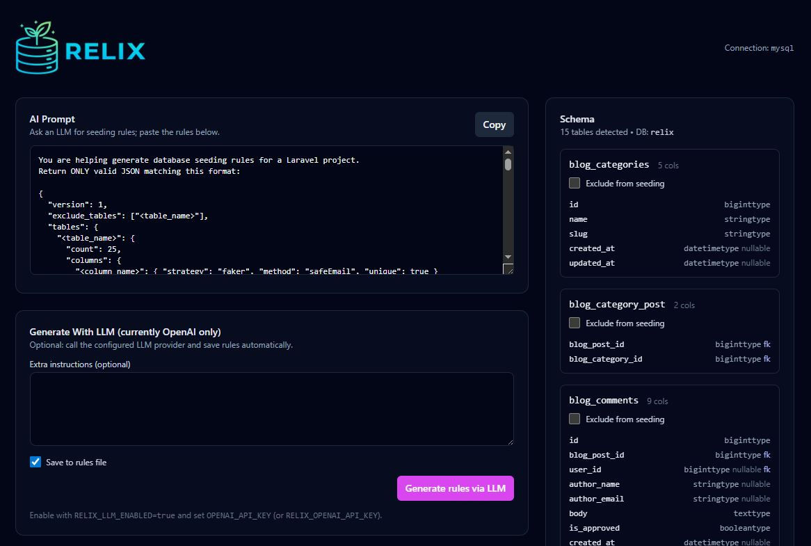

# Laravel Relix

Generate Laravel database seeders (or seed directly) from your **current database schema** using `doctrine/dbal` introspection + `fakerphp/faker`.

> [!WARNING]
> Laravel Relix is currently in **alpha**. Expect breaking changes and unfinished features.

## Install

```bash
composer require charlgottschalk/laravel-relix
```

Publish config (optional):

```bash
php artisan vendor:publish --tag=relix-config
```

Publish UI assets (optional):

```bash
php artisan vendor:publish --tag=relix-assets
```

This publishes package assets (like `logo.png`) to `public/vendor/relix`.

## Commands

- Generate missing Eloquent factories:
  - `php artisan relix:generate-factories`
- Generate seeder classes:
  - `php artisan relix:generate-seeders --count=25`
  - Add `--factories` to generate missing factories first
  - Output defaults to `database/seeders/Relix`
- Seed directly (no files generated):
  - `php artisan relix:seed --count=25`
  - Add `--truncate` to wipe tables first (driver-specific behavior)

## Using the generated `RelixDatabaseSeeder`

After generating seeders, Relix also generates `Database\\Seeders\\Relix\\RelixDatabaseSeeder`.

To run it from your main `DatabaseSeeder`, add:

```php
<?php

namespace Database\Seeders;

use Illuminate\Database\Seeder;
use Database\Seeders\Relix\RelixDatabaseSeeder;

class DatabaseSeeder extends Seeder
{
    public function run(): void
    {
        $this->call(RelixDatabaseSeeder::class);
    }
}
```

## UI

Enabled by default in `local` only.

- Visit `/{RELIX_UI_PATH}` (default: `/relix`)
- Save rules JSON, generate seeders, or seed immediately
  - Optional: generate rules via LLM if enabled



Config: `config/relix.php`

## LLM (optional)

Relix supports both workflows:
- Copy the prompt and paste rules JSON manually (default)
- Call an LLM provider to generate rules JSON

Env:

```bash
RELIX_LLM_ENABLED=true
RELIX_LLM_PROVIDER=openai
OPENAI_API_KEY=...
```

Optional:

```bash
RELIX_OPENAI_MODEL=gpt-4o-mini
RELIX_OPENAI_BASE_URL=https://api.openai.com/v1
```

CLI:

```bash
php artisan relix:llm-rules --save
```

## Tailwind setup

Relix views use Tailwind utility classes.

By default, the Relix UI will load Tailwind via CDN for convenience in local/dev:

```bash
RELIX_UI_TAILWIND_CDN=true
```

If you want to use your app’s compiled Tailwind instead, disable the CDN and ensure your Tailwind build includes the vendor views:

```bash
RELIX_UI_TAILWIND_CDN=false
```

Then add this to your `tailwind.config.js` `content`:

```js
content: [
  "./vendor/charlgottschalk/laravel-relix/resources/views/**/*.blade.php",
],
```

## Rules format (JSON)

Rules are stored at `storage/app/relix/rules.json` (or `RELIX_RULES_PATH`).

Example:

```json
{
  "version": 1,
  "exclude_tables": ["migrations"],
  "tables": {
    "users": {
      "count": 50,
      "columns": {
        "email": { "strategy": "faker", "method": "safeEmail", "unique": true },
        "password": { "strategy": "hash", "value": "password" },
        "role": { "strategy": "literal", "value": "user" }
      }
    }
  }
}
```

## Eloquent factories (optional)

If `RELIX_ELOQUENT_ENABLED=true` and a table has a matching Eloquent model with a factory, Relix will prefer seeding via `Model::factory()` (unless you have explicit rules for that table).
